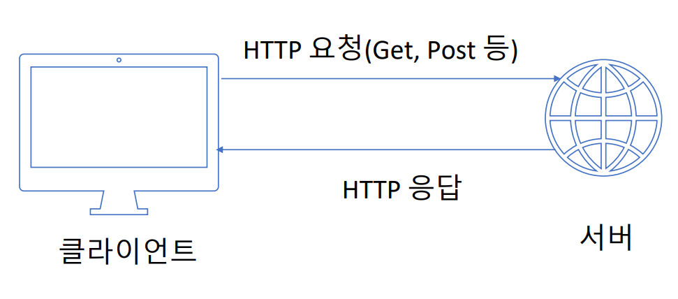
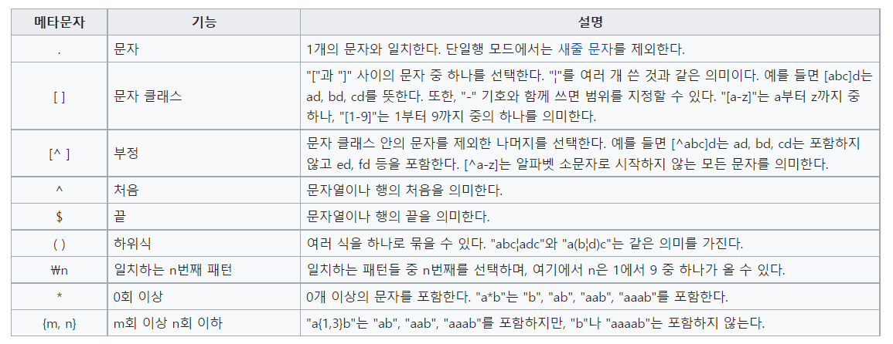
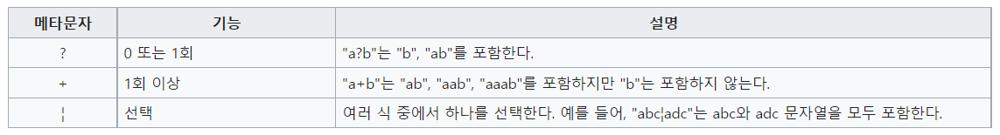
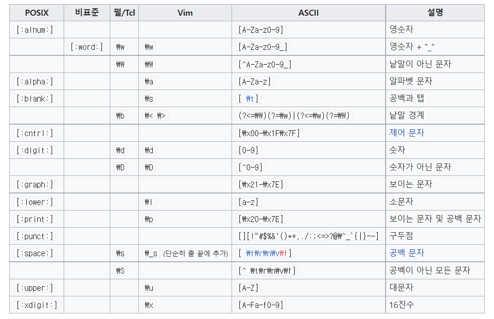

# 0. 개요

- 최종 수정일: 22.06.14
- 내용: 간단한 크롤링 관련 정리

# 1. 크롤링 도구

- 개발자도구

  - HTML 문서를 확인해볼 수 있는 **Elements**

  - 주고 받는 요청과 응답을 확인해볼 수 있는 **Network**

    - XHR: 비동기적 요청과 응답에 대한 정보를 보여준다.

  - HTTP(HyperText Transfer Protocol)

    - HTML문서를 전송하는 규약

      

    - **클라이언트(Ex. crome)는 URL 등을 통해 특정 요청을 보내고 HTML을 받아 rendering 한다.**

    - GET: URL에 포함시켜 **보이는 방식**으로

    - POST: form에 포함시켜 **보이지 않는 방식**으로

- requests

  - `import requests`
  - `requests.get(url)` 
  - `requests.post(url, data)`
    - form data에 들어갈 정보를 dict를 통해 data에 넘긴다.
  - headers 정보가 필요한 경우 넘겨준다.
  - requests 객체의 사용
    - text : 요청 후 HTML 받아오기
    - status_code : 요청 결과의 응답코드 확인
    - json: json 데이터를 dict로 받아오기 
  - 요청 종류
    - 1XX: 정보 > 정보 수신 완료 후 추가 작업 진행
    - 2XX: 성공
    - 3XX: 리다이렉션 > 추가 작업 필요
    - 4XX: 클라이언트 오류 > 요청 오류 / Headers 등을 통한 권한 부여 등이 필요
    - 5XX: 서버 오류 > 응답 오류

- BeautifulSoup

  - `import BeautifulSoup`

  - soup 객체의 사용

    - `find(tag, attrs)` : 원하는 tag와 일치하는 첫번째 tag찾기, attrs는 단일 or 복수를 dict로 전달
    - `find_all(tag)` : 원하는 tag와 일치하는 모든 tag를 list로 받기
    - `get_text` : soup 객체의 value를 반환
    - `[attr]` : soup 객체의 attr을 반환
    - `select(option)` : option에 맞는 모든 것을 찾아서 반환
      - option에는 tag, id(#), class(.), 자손(tag tag), 자식(>)
      - ~로 시작`^=`, ~로 끝나는`$=`, ~를 포함하는 `*=`, n번째 자식`nth-child`

  - 정규표현식

    - `import re`
    - .compile()

    

    

    

- data.go.kr

  - API : 사용가능한 명령을 정리하고, 명령을 받으면 응용프로그램과 상호작용하여 요청에 응답하는 프로그램간 매개체
  - 국가가 관리하는 공공 오픈 API
  - 요청 > 키 > 문서 순으로 확인하여 사용한다.

  

# 2. 로그인 후 크롤링

- 순서: endpoint 찾기 > form data 구성 > session 객체 생성 > session 객체에서 크롤링

# 3. Seleniun

- 크롤링의 끝판왕
- 직접 브라우저를 조작하며 크롤링
- selenium 설치와 chrome driver를 설치 후 사용
- 주요 메서드
  - `get(url)`: 브라우저 열기
  - `send_keys(value)`: 입력
  - `page_source`: HTML을 page 그대로 받기
  - `close()`: 브라우저 닫기
  - `WebDriverWait(driver, time)`: 특정 시간동안 지연
  - `until(EC(By, attr))`: 특정 사건까지 지연