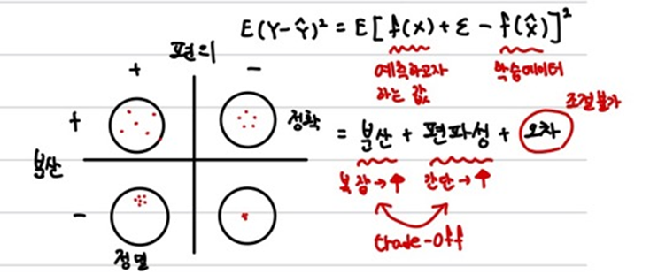

# 1. 머신러닝의 개념

1. 독립변수 X(데이터, 행렬)로 부터 종속변수 Y를 예측하는 것. 
2. X의 특징을 추출
3. `y' = f(x')` : y'는 추측의 결과값, x'은 표본데이터, f는 머신러닝 모델

# 2. 머신러닝의 종류

1. 지도학습
   - 회귀(연속변수), 분류(이산변수)를 통해 결과를 예측하거나 분류하는 것을 목적으로 한다.
   - 라벨링된 데이터를 활용한다.
   - 선형회귀분석
     - X와 Y가 선형적인 관계일 때 수행가능
     - 독립변수의 중요도 파악이 쉽다.
   - 의사결정나무
     - 독립변수의 조건에 따라 종속변수를 분리
     - 이해하기 쉬우나 과적합이 쉽게 발생
   - KNN
     - 새로 들어온 데이터와 주변 k개의 데이터 간의 거리를 통해 class를 분류
   - Neural Network
     - 입력 - 은닉 - 출력층으로 구성되어 노드의 가중치를 학습
     - 시간이 오래 걸리고 과적합 문제가 심하다
     - 알고리즘과 GPU의 발전으로 딥러닝 모델의 기반이 되었다.
     - cf) CNN / RNN / Auto Encorder > ResNet / Dense Net > 네트워크 초기화 / Activation Function / Generalization / overfitting / semi-supervised
   - SVM
     - class간의 거리가 최대가 되도록 decision boundary를 만든다.
     - 어느정도의 오차를 인정하여 overfitting을 해결하지만 시간이 매우 오래 걸린다.
   - Ensembel Learning
     - 최근 가장 뛰어난 성능을 보이는 알고리즘
     - 다양한 데이터, 다양한 모델을 결합하여 사용
2. 비지도 학습
   - 그룹화를 목적으로 하며 군집분석, PCA 등의 방법이 있음
   - K-means clustering
     - 임의의 점을 찍고 그 주변에 가까운 데이터를 분류하는 작업을 반복하여 그룹화
     - 단순한 데이터만을 잘 분류한다.
3. 강화학습
   - 특정 환경에서 어떤 state에 있을 때, 해당 state에서 취할 수 있는 action에 따라 다음 state와 reward가 결정되고 이를 반복시행하여 최대의 reward를 얻는 방법은 찾는 것
   - 유망한 방법이지만 현재 직접 활용되고 있는 분야는 적음
   - 시간 단축 / Continuous Action / Sparse Reward / Multi Agent 등의 문제를 해결해야 함

4. GAN

   - 현재 가장 각광받는 알고리즘 중 하나

   - 생성자와 평가자를 서로 대립적으로 학습시킴으로써 점점 더 진짜 같은 가짜를 생성자가 만들 수 있도록 함 

     

# 3. 모델 적합성 평가 및 실험 설계

1. 모델 성능은 대체로 MSE를 가지고 수행하며 복잡도가 낮을 대 발생하는 과소적합과 복잡도가 높을 대 발생하는 과대적합 문제를 해결해야 함.
2. 실험은 `raw > 전처리 > 실험설계 > model >  평가`순으로 이루어짐
   - **많은 고민을 통해 목적에 맞는 방법을 택하여 전처리와 실험설계를 수행해야 함.**
   - 데이터의 특징, 목적 등을 종합적으로 고려
   - 설계 시, 데이터를 나누는 방식은 다양하지만 대표적으로는 train : validation : test = 5 : 3 : 2를 사용함.
     - train은 학습, validation은 hyperparameter tuning, test는 성능평가에 사용되며 hyperparameter가 없을 경우 8:2를 사용하기도 함.
     - 데이터가 적을 대는 데이터를 K개의 그룹으로 나누어 K번째 그룹을 검증, 나머지를 학습데이터로 하여 성능을 평가한 뒤 평균을 내는 k-fold 교차검증이 사용되기도 함
     - 데이터가 너무 적을 때는 k-fold와 동일하나 모든 데이터 수만큼 그룹을 나누어 진행하는 LOOCV 방식을 사용하기도 함

3. 과적합
   - 데이터가 적을 때 혹은 복잡할 때 발생
   - 