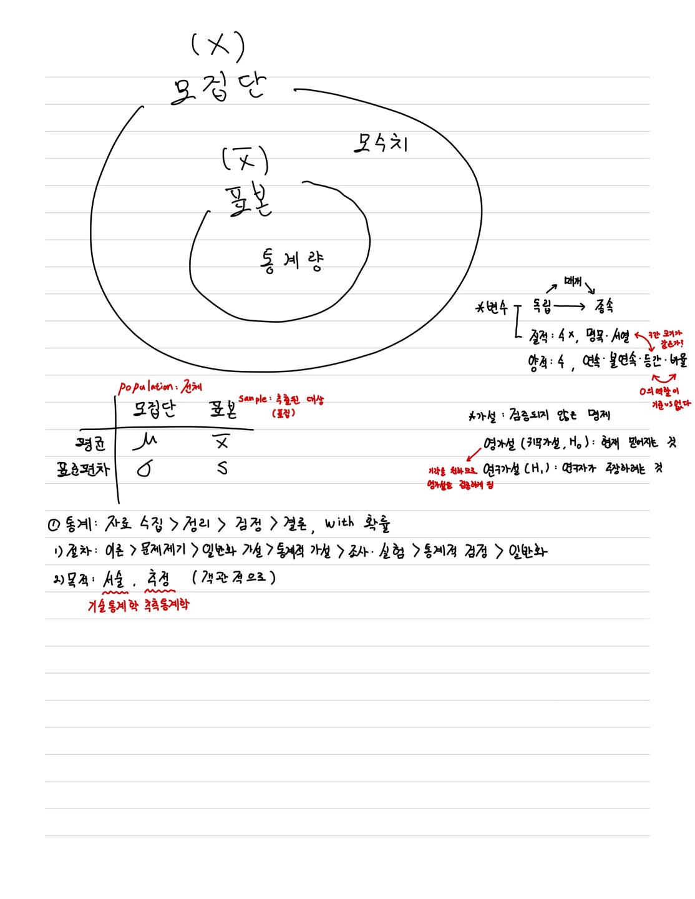
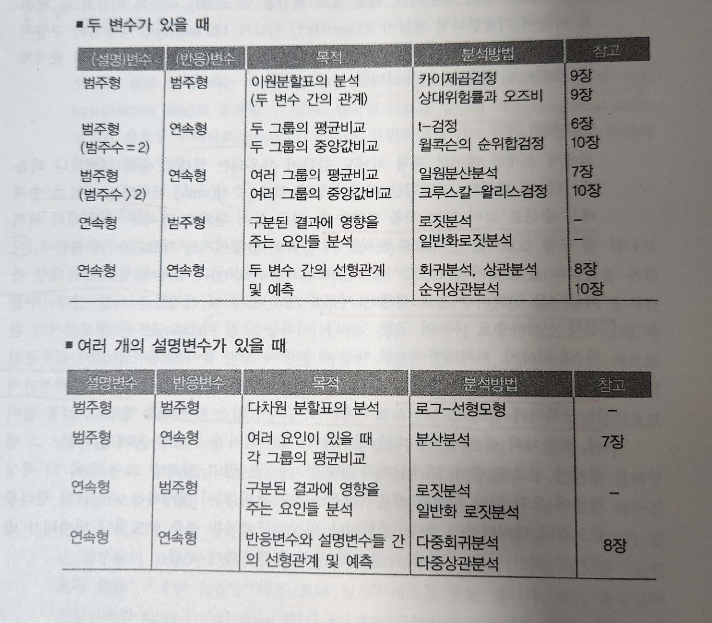

# 0. 요약



- 비율: 관측 도수 / 전체 도수

- 비: 분자가 분모에 부분집합이 아닐 수 있음

- 데이터 분석 개요

  

  

# 1. 다음의 각 상황에서 모집단과 표본을 정의하라.

1. 한 대학병원에서는 안정적인 협심증 환자에 있어서 관상동맥의 직경과 콜레스테롤 수치의 변화를 알아보기 위해, 40명의 환자를 대상으로 연구를 실시하였다.

   ```
   모집단 : 협심증 환자
   표본 : 40명의 환자
   ```

2. 한 신문사는 새로운 보건복지정책에 대한 서울시민들의 지지도를 알아보기 위해 500명을 랜덤하게 뽑아 이들을 대상으로 지지여부를 조사하였다.

   ```
   모집단 : 서울시민
   표본 : 500명
   ```

   

# 2. 다음 데이터의 유형을 구분하여 보라.

1. 인구 1000명당 질병 발생율

   ```
   답 : 비율
   해설 : '해당 질병을 가진 환자 / 전체 인구'로 구해질 것이고 해당 질병을 가진 환자는 전체 인구에 부부집합이다.
   ```

2. 1차 치료 후 재발까지 걸린 시간

   ```
   답 : 양적 / 수치형 > 연속형
   해설 : 시간은 숫자로 표현 가능하고 연속적이다.
   ```

3. 비만여부

   ```
   답 : 질적 / 범주형 > 명목형
   해설 : 비만 여부는 `맞다`, `아니다`로 표현된다.
   ```

4. 1일 내원 환자수

   ```
   답 : 양적 / 수치형 > 이산형
   해설 : 사람 수에 해당하므로 숫자로 표현 가능하고 불연속이다.
   ```

5. 출생지역

   ```
   답 : 질적 / 범주형 > 명목형
   해설 : '서울', '대전'과 같이 표현된다.
   ```
