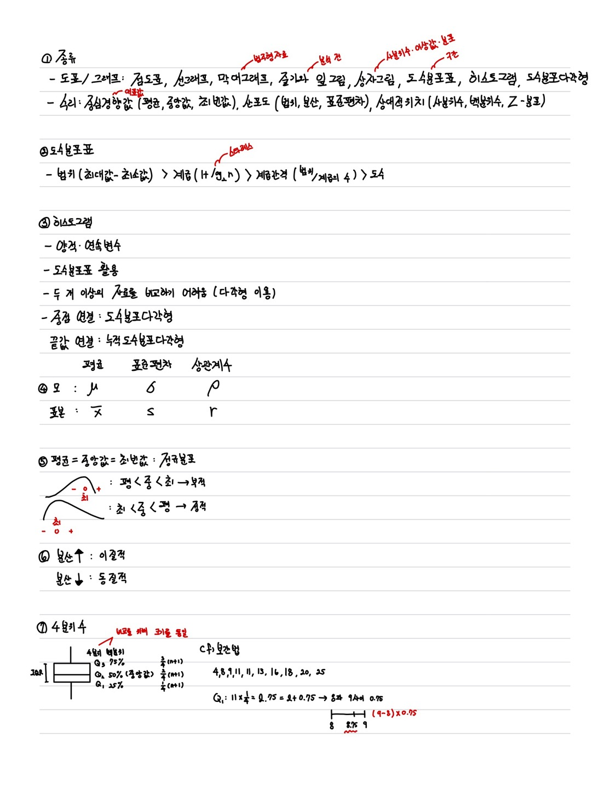
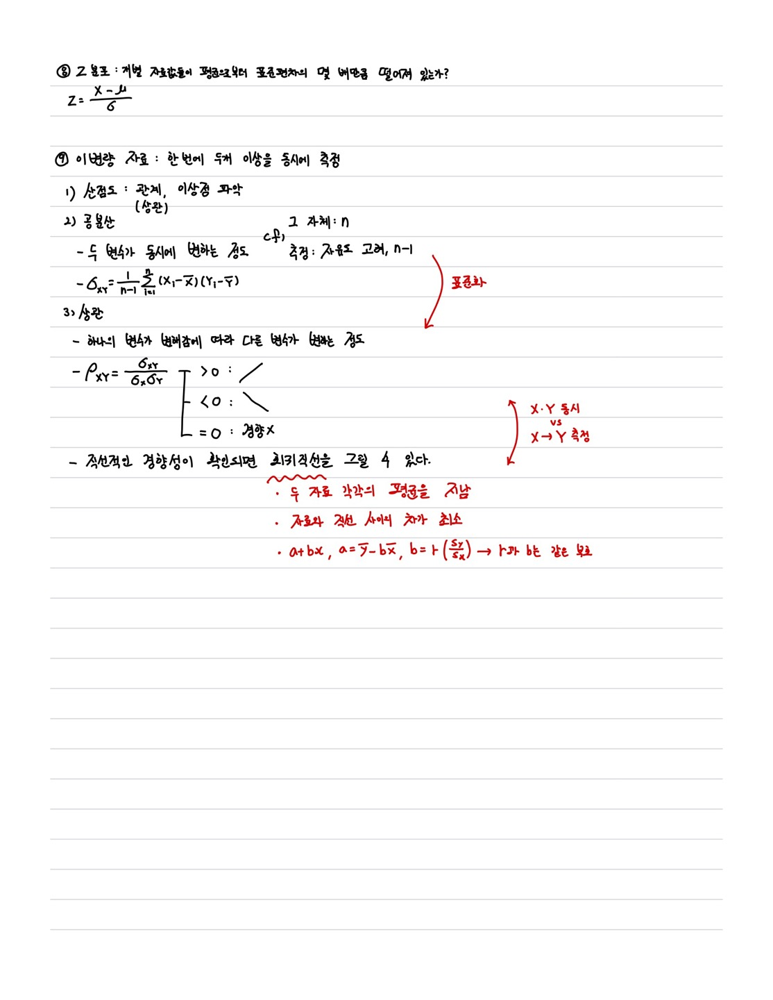
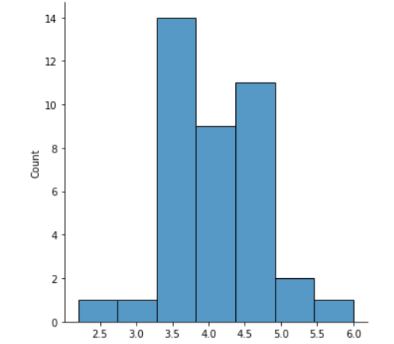
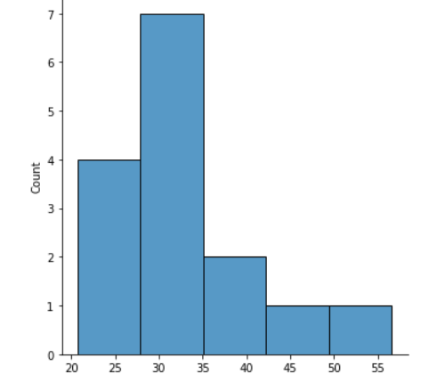
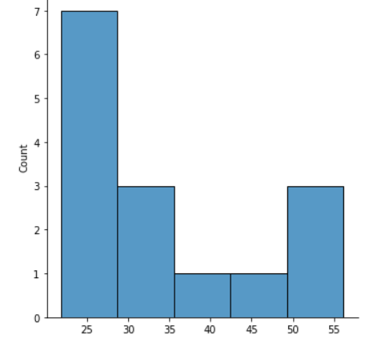

# 0. 요약





- 단순히 분산이 크다고 이산성이 강하다고 볼 수 없다. > 변동계수(CV = s/x * 100%)를 고려한다
- 왜도
  - `+`: 최중평
  - `-`: 평중최
  - 0: 좌우대칭
- 첨도 : 값이 증가할수록 최빈값이 전체 데이터에서 차지하는 비중이 커진다.


# 1. X 증후군에 취약한 지능이 떨어진 12명의 환자에게 청각 뇌간 반응에 대해 알아보았다. 다음은 이들 환자의 IQ 점수이다.

#### data = 17 22 17 18 17 19 34 26 14 33 21 29

1. 평균과 중앙값, 최빈수를 구하라

   ```
   > 평균 = 22.25
   > 최빈값 = 17
   > 중앙값 = 20
   ```
   
2. 범위와 분산, 표준편차를 구하라

   ```
   > 범위: 20
   > 분산: 41.2
   > 표준편차: 6.4
   ```
   
3. 변동계수를 계산하라

   ```
   > 28.8%
   ```


# 2. 한 연구자는 생물학적 특징을 알아내기 위하여 일련의 육종을 조사하였다. 다음은 육종을 가진 20명의 대상자의 유방에서 제거해 낸 종양의 직경이다.

#### data = 0.5 1.2 2.1 2.5 3.0 3.8 4.0 4.2 4.5 5.0 5.0 5.0 5.0 6.0 6.5 7.0 8.0 9.5 13.0

1. 평균과 중앙값, 최빈수를 구하라

   ```
   > 평균 = 5.0
   > 최빈값 = 0.5
   > 중앙값 = 5
   ```
   
2. 범위와 분산, 표준편차를 구하라

   ```
   > 범위 = 12.5
   > 분산 = 8.3
   > 표준편차 = 2.9
   ```

3. 변동계수를 계산하라

   ```
   > 57.0%
   ```


# 3. 다음은 의대 1년생들의 혈당치를 잰 것이다.

#### data = 4.7 3.6 3.8 2.2 4.7 4.1 3.6 4.0 4.4 5.1 4.2 4.1 4.4 5.0 3.7 3.6 2.9 3.7 4.7 3.4 3.9 4.8 3.3 3.6 4.6 3.4 4.5 3.3 4.0 3.4 4.0 3.8 4.1 3.8 4.4 4.9 4.9 4.3 6.0

1. 평균과 표준편차를 구하라.

```
> 평균 = 4.1
> 표준편차 = 0.7
```

2. 중앙값과 사분위범위를 구하라.

```
> 중앙값 = 4
> 사분위범위
 Q1 = 3.6
 Q2 = 4
 Q3 = 4.75
 Q4 = 6.0
 IQR = 1.15
 
[2.2, 2.9, 3.3, 3.3, 3.4, 3.4, 3.4, 3.6, 3.6, 3.6, 3.6, 3.7, 3.7, 3.8, 3.8, 3.8, 3.9, 4.0, 4.0, 4.0, 4.1, 4.1, 4.1, 4.2, 4.3, 4.4, 4.4, 4.4, 4.5, 4.6, 4.7, 4.7, 4.7, 4.8, 4.9, 4.9, 5.0, 5.1, 6.0]
```

3. 왜도와 첨도를 계산하고 데이터의 분포를 추측하라.

```
> 왜도 : 0.07
> 첨도 : 0.82
```




# 4, 한 연구자는 혈액응고 연구를 위해 두 혈액 수집 방법을 비교하였다. 두 방법 간에 차이가 있는 것으로 보이는가?

#### data1 = 20.7 29.6 34.4 56.6 22.5 29.7 31.2 38.3 28.5 22.8 44.8 41.6 24.9 29.0 30.1

#### data2 = 23.9 23.2 56.2 30.2 27.2 21.8 53.7 31.6 24.6 49.8 22.6 48.9 23.1 34.6 41.3

```
> data1
 1. 평균 : 32.3
 2. 표준편차 : 9.6
 3. 왜도 : 0.65
 4. 첨도 : -1.12
 
> data2
 1. 평균 : 34.2
 2. 표준편차 : 12.5
 3. 왜도 : 0.65
 4. 첨도 : -1.16
 
> 아래 그래프를 참고할 때 통계량은 큰 차이가 나지 않는 것처럼 보이지만 실제로는 차이가 크다.
```




