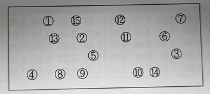
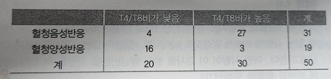

# 0. 요약


# 1. 다음과 같이 1부터 15까지의 숫자가 적혀있는 공들이 상자에 들어있다. 임의로 공을 하나 꺼냈을 때 공에 쓰인 숫자가 7 이상일 확률은?




```
7이상 15이하의 공 : 9개
전체 : 15개

9 / 15 = 3 / 5
```


# 2. 다음의 표는 50명의 남성동성애자에서의 혈청양성반응여부와 T-림프구의 T4/T8 비를 보여준다. 양성반응으로 나타났을 때 T4/T8이 낮게 나올 확률은?



```
P(A): 혈청양성반응 = 19 / 50
P(A n B): 혈청양성반응이면서 T4/T8비가 낮음 = 16 / 50

따라서 P(B | A) = 16 / 19
```


### 3. 10명 중 2명꼴로 발병하는 질병의 진단법을 개발하였다. 이 진단법을 사용하면, 질병이 있는 사람의 90%가 양성으로 나타나며, 질병이 없는 사람 중 5%가 양성으로 나타난다고 한다. 어떤 사람이 이 검사를 받아 양성반응을 보였을 대 이 사람이 실제로 병에 걸렸을 확률은?

```
임의로 표본수를 1000명이라 했을 때, 위의 확률에서
병O: 200
병X: 800

이때 양성반응을 보일 확률은
200 * 0.9 = 180
800 * 0.05 = 40

따라서 180 / 220 = 0.82
```


### 4. 편두통이 있는 환자 15명에게 새로 개발된 진통제를 투약하였다. 이 진통제는 약 80%의 진통효과가 있다고 한다. 15명 중 10명에게 진통효과가 있을 확률과 12명 이하에게 진통효과가 있을 확률을 구하라

```
1. 15명 중 10명에게 진통효과가 있을 확률
15C5 * (0.8 ** 10) * (0.2 ** 5) = 0.1032

2. 15명 중 12명 이하에게 진통효과가 있을 확률
1 - P(X=13) - P(X=14) - P(X=15)
P(X=n) = 15Cn * (0.8 ** n) * (0.2 ** (15-n))
위의 두 식에 의해 0.6020
```


### 5. 시행횟수가 20이고 성공확률이 0.7일 때 성공횟수가 3에서 7 사이일 확률과 시행횟수가 15이고 성공확률이 0.8일 때 누적확률값이 0.95 이상이 되는 최소의 성공횟수를 구하라

```
1. 시행횟수가 20이고 성공확률이 0.7일 때 성공횟수가 3에서 7사이일 확률
P(X=3) + P(X=4) + P(X=5) + P(X=6) + P(X=7)
P(X=n) = 20Cn * (0.7 ** n) * (0.3 ** (20-n))
위의 두 식에 의해 0.0012

2. 시행횟수가 20이고 성공확률이 087일 때 누적확률값이 0.95이상이 되는 최소의 성공횟수
P(X=n) = 20Cn * (0.8 ** n) * (0.2 ** (20-n))
위의 식에 n이 1일 때부터 대입하면 14
```


### 6. 변수 Z가 표준정규분포를 따를 때, P(Z<=1.25), P(Z>=1.25), P(-a<=Z<=a)=0.95인 a의 값을 구하라

```
1. P(Z<=1.25) = 0.8944
2. P(Z>=1.25) = 1- P(Z<=1.25) = 1 - 0.8944 = 0.1056
3. P(-a<=Z<=a)=0.95인 a
P(Z<=a) - P(Z<=-a) = 0.95
따라서 a = 1.96
```


### 7. 3세 이상 74세 이하의 여성 중에서 헤모글로빈 수치는 평균이 13.3g/100mL, 표준편차가 1.12g/100mL라고 한다. 이때 헤모글로빈 수치가 13.0이상 13.9이하일 확률, 상위 5%에 해당하는 헤모글로빈 수치는 얼마인지 구하라

```
1. 헤모글로빈 수치가 13.0이상 13.9이하일 확률
X ~ N(13.3, 1.12^2)
X = 13 > Z = -0.27
X = 13.9 > Z = 0.54

따라서
P(Z<=0.54) - P(Z<=-0.27) = 0.31

2. 헤모글로빈 수치가 상위 5%에 해당하는 헤모글로빈 수치
P(Z>a) = 0.05 > P(Z<a) = 0.95
위 식을 만족하는 a = 1.65

따라서
X = (1.65 * 1.12) + 13.3 = 15.14
```


### 8. 어떤 민족의 두개골 길이는 근사적으로 평균이 185.6 mm, 표준편차가 12.7 mm인 정규분포를 따르는 것으로 알려져 있다. 이 집단에서 10개의 표본을 뽑았을 때 평균이 190 mm이상일 확률을 구하라

```
모집단이 정규분포를 따르므로 10개의 표본들은 표집분포를 따른다.
모집단이 N(185.6, 12.7^2)이므로, 표집분포는 N(185.6, 12.7^2 / 10)이다.

(190 - 185.6) / root(16.13) = 1.10이므로,  P(Z>1.10) = 1 - P(Z<1.10) = 0.1357
```


### 9. 건강한 남자의 혈청 철분수치는 평균 120이고, 표준편차는 15로 알려져 있다. 50명의 정상인을 무작위로 추출했을 대 평균이 115에서 225사이에 있을 확률을 구하라

```
30개 이상의 충분한 표본크기로 50개의 표본들은 표집분포를 따른다.
모집단이 N(120, 15^2)이므로, 표집분포는 N(120, 15^2 / 50)이다.

(115 - 120) / root(4.5) = -2.36
(125 - 120) / root(4.5) = 2.36
P(-2.36 < Z < 2.36) = (1 - P(Z < 2.36)) * 2 = 0.9818
```


### 10. 우리나라 남자의 약 6%에서 적녹 색각 이상이 나타난다고 한다. 우리나라 남자 중에서 임의로 200명을 뽑았을 때 표본에서 적녹 색각 이상인 사람이 8% 이상 나타날 확률은 얼마인가?

```
30개 이상의 충분한 표본크기로 200개의 표본들은 표집분포를 따른다.
표본비율의 경우 분산이 (p(1-p) / n)이다.
즉 표집분포는 N(0.06, 0.00028)이다.

(0.08 - 0.06) / root(0.00028) = 1.20이므로,  P(Z>1.20) = 1 - P(Z<1.20) = 0.1151
```


### 11. 어느 대학의 한 학과는 60명의 여자와 40명의 남자로 구성되어 있다. 이들을 대상으로 조사한 결과 10명의 여학생과 8명의 남학생이 알러지성 비염 증상이 있었다.

1. 이 학생들 중에서 1명을 무작위로 뽑았을 때 그 학생이 알러지성 비염이 있을 확률은 얼마인가?

   ```
   알러지성 비염이 있는 학생 수 = 18
   전체 학생 수 = 100
   
   따라서
   18 / 100
   ```

2. 남학생 중에서 한 명을 뽑았을 때 그 학생이 알러지성 비염이 있을 확률은 얼마인가?

   ```
   남학생 수 = 40
   남학생 중 알러지성 비염이 있는 학생 수 = 8
   
   따라서
   8 / 40
   ```

3. 알러지성 비염이 있으면서 동시에 남학생일 확률이 있을 확률은 얼마인가?

   ```
   알러지성 비염이 있을 확률 P(A) = 18 / 100
   남학생일 확률 P(B) = 40 / 100
   남학생 중에서 한 명을 뽑았을 때 그 학생이 알러지성 비염이 있을 확률 P(A | B) = 8 / 40
   
   P(A n B) = P(A | B) * P(B) = (8 / 40) * (40 / 100)
   ```


### 12. 임신진단시약에 대한 연구에서 한 시약의 경우 임신했을 때 양성으로 판정될 확률이 80%이고, 임신하지 않았는 데도 양성으로 판정될 확률이 32%인 것으로 나타났다. 임신진단시약을 사용하는 사람 중에서 실제로 임신하는 사람의 비율이 60%라고 하자. 이 임신진단시약을 이용하여 검사했을 대 양성으로 나왔다면, 실제로 임신이 되었을 확률은 얼마인가?

```
표본을 1000명이라 하면
임신O = 600
임신X = 400

양성으로 판정될 확률은
600 * 0.8 = 480
400 * 0.32 = 128

따라서 480 / (480 + 128)
```


### 13. 어느 나라에서는 인구의 약 85%가 Rh+의 혈액형을 가지고 있다고 한다. 이 중에서 7명을 임의로 선택했다고 하자. 다음의 확률을 구하라.

1. 5명이 Rh+의 혈액형을 가지고 있을 확률

   ```
   P(X=5) = 7C5 * (0.85 ** 5) * (0.15 ** 2)
   ```

2. 5명 이상이 Rh+의 혈액형을 가지고 있을 확률

   ```
   P(X>=5) = P(X=5) + P(X=6) + P(X=7)
   7C5 * (0.85 ** 5) * (0.15 ** 2) +
   7C6 * (0.85 ** 6) * (0.15 ** 1) +
   7C7 * (0.85 ** 7) * (0.15 ** 0) +
   ```


### 14. 어느 변수 Z가 평균 0, 표준편차가 1인 표준정규분포를 따를 때 다음의 값을 구하라.

1. P(Z>2.6)

   ```
   P(Z>2.6) = 1 - P(Z<2.6) = 0.0047
   ```

2. P(Z<1.2)

   ```
   0.8849
   ```

3. P(-1.7<=Z<=3.1)

   ```
   P(Z<3.1) - P(Z<-1.7) = 0.9990 - 0.0446 = 0.9544
   ```

4. P(Z>=b) = 0.8인 경우 b

   ```
   P(Z<b) = 0.2와 같으므로 b = -0.84
   ```


### 15. 지문감식에 있어서 중요한 요소 중 하나가 열손가락 전체의 융선의 개수이다. 융선의 개수는 평균이 140, 표준편차가 50인 정규분포를 따른다고 한다. 다음의 확률을 구하라.

1. 융선이 200개 이상일 확률

   ```
   X = 200 > Z = (200 - 140) / 50 = 1.2
   P(Z>1.2) = 1 - P(Z<1.2) = 1 - 0.8849 = 0.1151
   ```

2. 융선이 100과 200 사이일 확률

   ```
   X = 100 > Z = (100 - 140) / 50 = -0.8
   P(Z<1.2) - p(z<-0.8) = 0.8849 - 0.2119 = 0.673
   ```


### 16. 어느 대학의 입학시험점수는 평균이 500이고 표준편차가 100인 정규분포를 따른다고 한다.

1. 한 학생을 뽑았을 때 그 학생의 성적이 650점 이상일 확률은 얼마인가?

   ```
   X = 650 > Z = (650 - 500) / 100 = 1.5
   P(X > 1.5) = 1 - P(X<1.5) = 1 - 0.9332 = 0.0668
   ```

2. 이 시험에서 670점을 넘어야 합격한다면 몇 퍼센트의 학생이 합격하겠는가?

   ```
   X = 670 > Z = (670 - 500) / 100 = 1.7
   P(X > 1.7) = 1 - P(X<1.7) = 1 - 0.9554 = 0.0446
   ```

3. 60%의 학생을 합격시키기 위해서는 커트라인을 몇 점으로 하면 되겠는가?

   ```
   P(X>a) = 1 - P(X<a) = 0.6
   P(X<a) = 0.4
   a = -0.25
   
   따라서 X = (-0.25 * 100) + 500 = 475
   ```


### 17. 미국에 거주하는 20세에서 74세 사이의 남자들의 혈청 콜레스테롤 수치는 평균이 211, 표준편차가 46으로 알려져 있다. 이 집단에서 30명을 무작위로 추출했다고 하자. 표본의 평균이 230 이상일 확률은?

```
30개 이상의 충분한 표본크기로 30개의 표본들은 표집분포를 따른다.
모집단이 N(211, 46^2)이므로, 표집분포는 N(211, 46^2 / 30)이다.

(230 - 211) / root(70.53) = 2.26이므로,  P(Z>2.26) = 1 - P(Z<2.26) = 0.0119
```


### 18. 어느 집단에서 하나 이상의 만성병으로 고통받는 사람이 35%라고 알려져 있다. 이 집단에서 200명을 무작위로 추출했을 때 40% 이상이 하나 이상의 만성병을 가지고 있을 확률은 얼마인가?

```
30개 이상의 충분한 표본크기로 200개의 표본들은 표집분포를 따른다.
표본비율의 경우 분산이 (p(1-p) / n)이다.
즉 표집분포는 N(0.35, 0.0011375)이다.

(0.4 - 0.35) / root(0.0011375) = 1.48이므로,  P(Z>1.48) = 1 - P(Z<1.48) = 0.0694
```

